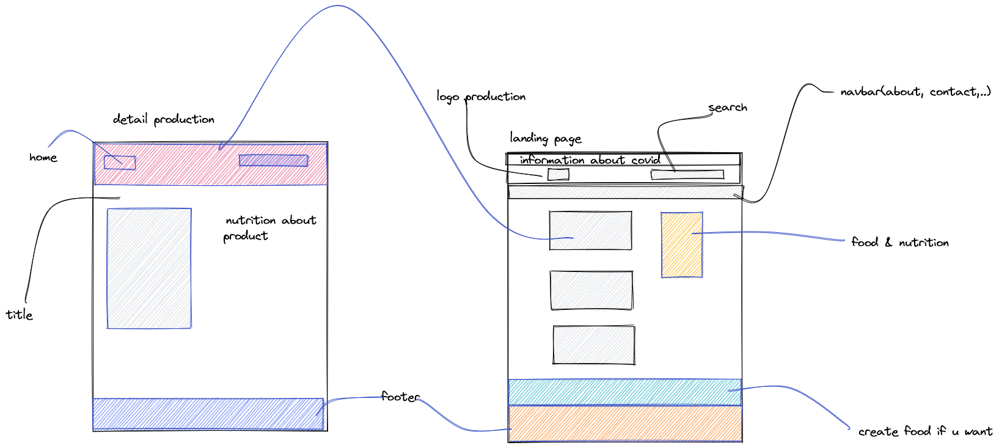

# Eating everywhere and any time

This is my project at coderschool.
This is a font-end project utilizing json-server and postman.
## File Structure
```
/- Eating W&T
    /- assets
        /- css
            /- style.css
            /- grid.css
            /- base.css
        /- img
            /- backgound.jpg
            /- header.jpg
            /- inforgraphic.jpg
    /- index.html
    /- index.js
```
## UI Mockup



## Feature Overviews
-Landing page showing list of food at VietNamese.
-At landing page, you can create, delete and update famous vietnamese food if you want.
## End Point

- /foods :for getting 10 or more foods.
- /foods/title: for getting title.
- /foods/description: for getting description.
- /foods/imgUrl: for getting imgUrl.
- /foods/id: for getting id.

## CLI usage
- /npm start: for starting json-server.
- /npm watch: for listen you change in your sass code into css.
- ctrl + C: exist your json-server.

## Getting started
#### Install our website

```js
$ git clone ... 
```
